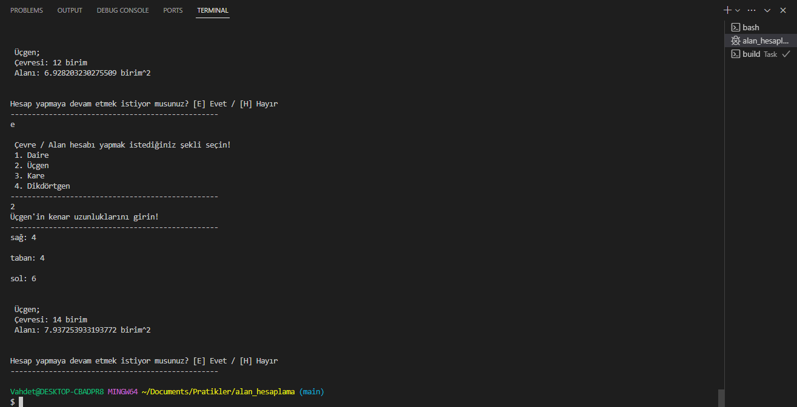

# Alan Hesaplama
Bu uygulama kullanıcıdan alınan şekil ve ölçü bilgilerini kullanarak çevre ve alan hesabı yapan bir konsol uygulamasıdır. **PatikaAcademy.dev** platformunun **Başlangıç Seviyesi .Net Core Patikası** eğitimi kapsamında **C# Projeleri** dersi için yapılmıştır.

| İçerik |
| :-: |
| .gitignore |
| README.md |
| LICENSE |
| Console Application |

**Örnek Görsel**


## Installation
Öncelikle projeyi klonlayın.

```
git clone https://github.com/vahdetsavci/alan_hesaplama.git
```

## Usage
Projeyi klonladıktan sonra **Visual Studio Code** üzerinde açınız.

```
cd alan_hesaplama
code .
```

## LICENSE
[MIT](LICENSE)
